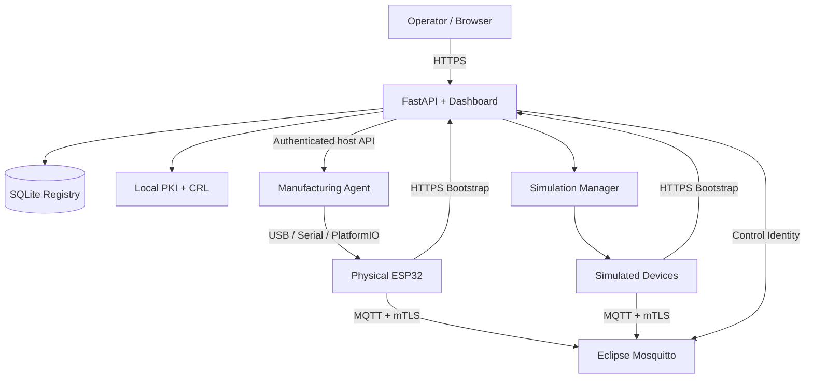

# Secure IoT Device Platform

**End-to-end secure device identity for ESP32 fleets: manufacturing bootstrap, on-device P-256 keys, X.509 enrollment, MQTT/mTLS authorization, revocation, fleet control, and realistic simulation.**


This repository is a complete research-grade implementation of the device-identity lifecycle for constrained IoT products. Multiple units of the **same product family run the same firmware image**, while manufacturing injects only a per-device bootstrap identity. On first secure startup, the device generates its own operational private key, proves possession of its manufacturing secret, enrolls an individual X.509 certificate, and then uses that certificate for MQTT/mTLS telemetry and control.

The platform is implemented on real ESP32 hardware and mirrored by software devices that use the same enrollment and MQTT/mTLS path, making the repository useful both as an IoT security demonstrator and as a mixed physical/simulated testbed.

---

## Engineering snapshot

| Area | Implementation |
| --- | --- |
| Embedded | ESP32, Arduino-ESP32 framework, PlatformIO, mbedTLS |
| Bootstrap trust | Per-device 256-bit secret, one-use challenge, HMAC-SHA256 |
| Operational identity | Locally generated EC P-256 key, PKCS#10 CSR, X.509 certificate |
| Transport security | HTTPS provisioning, MQTT over mutual TLS |
| Authorization | Certificate-derived MQTT identity and per-device ACLs |
| Credential lifecycle | Persistent credentials, CRL-based revocation, controlled reset |
| Isolated networks | Signed local-time bootstrap; public NTP is not required |
| Backend | FastAPI, SQLite, local PKI, Eclipse Mosquitto |
| Deployment | Docker Compose plus host-side manufacturing agent |
| Testbed | Physical ESP32 devices and realistic simulated fleets |
| Product integrations | CromaLED, AREA LZ7, AS7341 |
| Validation | 72 pytest regressions, 8-control security report, live API/MQTT/CRL checks, automated physical/simulated benchmarks |

---

## What this project demonstrates

The core engineering problem is simple to state but easy to get wrong:

> How can a manufacturer keep one common firmware image per product family while still giving every physical unit a unique, revocable, cryptographically verifiable identity?

This platform keeps the common application firmware separate from per-device secrets and long-term credentials:

```text
COMMON PRODUCT FIRMWARE
        |
        +--> Unit A: Device ID + unique bootstrap secret
        +--> Unit B: Device ID + unique bootstrap secret
        +--> Unit C: Device ID + unique bootstrap secret
                         |
                         v
              first secure enrollment
                         |
                         v
              unique P-256 private key
              unique X.509 certificate
```

The operational private key is created locally on the device and is never transported to the server.

---

## End-to-end identity lifecycle


The canonical bootstrap proof is:

```text
IOT-BOOTSTRAP-V1\n
<device_id>\n
<session_id>\n
<nonce>\n
<sha256(DER_CSR)>\n
```

The CSR subject is treated as untrusted input. The certificate identity is derived by the server from the already authenticated registry `device_id`.

---

## Architecture



The Dockerized API never needs broad USB/COM access. Physical programming is isolated in a host-side Manufacturing Agent with an allowlisted set of product profiles.

---

## Security properties

The current implementation includes:

- unique random bootstrap secrets per device;
- no long-term operational credential embedded in the common firmware image;
- one-use challenge sessions with a random 256-bit nonce and a short TTL;
- HMAC-SHA256 proof bound to the exact DER CSR digest;
- on-device EC P-256 private-key generation;
- CSR signature / proof-of-possession validation;
- server-controlled certificate identity (`CN=<authenticated device_id>`);
- provisioning-server authentication using an installation-specific Root CA;
- no insecure TLS fallback in product firmware;
- signed local time for isolated networks without public NTP;
- MQTT client authentication using X.509 and mutual TLS;
- certificate CN bound to the authenticated MQTT identity and effective Client ID;
- per-device ACL isolation under `devices/<device_id>/...`;
- individual certificate revocation using a CRL and forced broker re-authentication;
- encrypted bootstrap-secret storage in the backend database;
- Git and Docker build-context exclusion for deployment secrets, PKI state, databases, logs, simulator identities, and firmware build caches.

The explicit trust model, limitations, and future hardening options are documented in [`docs/security_review.md`](docs/security_review.md).

---

## Security validation matrix

Release **v1.1.0** includes **72 hardware-independent pytest checks** plus separate live validation tools for controls that only make sense against a deployed API/broker. The concise security runner executes eight representative regressions and exports PASS/FAIL CSV evidence.

| Scenario | Expected result | Evidence / runner |
| --- | --- | --- |
| Wrong bootstrap secret | Enrollment rejected | pytest + `run-live-bootstrap-tests.bat` |
| Replayed/consumed challenge | Rejected | pytest + `run-live-bootstrap-tests.bat` |
| CSR substituted after HMAC generation | Enrollment rejected | pytest + `run-live-bootstrap-tests.bat` |
| CSR requests another device CN | Issued CN remains authenticated `device_id` | pytest + live bootstrap validation |
| Device publishes to another device branch | ACL denies operation | ACL regression + `run-live-mqtt-acl-test.bat` |
| Revoked certificate reconnects | Broker rejects certificate | PKI/control regression + `run-live-revocation-test.bat` |
| Windows metric log is UTF-16 | Metrics still extracted | pytest regression |
| Serial output contains non-cp1252 bytes | Manufacturing log does not crash | pytest regression |
| Reboot after enrollment | Stored credentials reused | Firmware persistence flow / physical validation |
| Same firmware on multiple units | Different identities and certificates | Manufacturing flow / physical validation |

See [`docs/security_validation_matrix.md`](docs/security_validation_matrix.md) for the detailed requirement-to-test mapping and [`tests/README.md`](tests/README.md) for the executable validation entry points.

---

## Physical product integrations

### CromaLED

- 11 independently controlled lighting channels.
- Separate **Current** and **Setpoint** values in the dashboard.
- Live lamp temperature when a valid UART measurement is available.
- Original lamp transport preserved on **UART0 at 9200 baud** after secure startup.
- UART0 remains at 115200 during factory/bootstrap diagnostics and is handed over to the CromaLED lamp interface at 9200 baud only after MQTT/mTLS is operational.

Channel order:

```text
ROYAL_BLUE, BLUE, CYAN, GREEN, LIME, LIME2,
AMBER, AMBER2, RED_ORANGE, RED, DEEP_RED
```

### AREA LZ7

- 6 channels: `BLUE`, `CYAN`, `GREEN`, `LIME`, `AMBER`, `RED`.
- Existing DALI application behavior retained.
- Same Current/Setpoint control model as CromaLED.

### AS7341

- F1-F8, NIR, Clear, gain, state, and sample-age telemetry.
- Read-only application command for the latest spectrum.

---

## Realistic simulated fleets

The simulator is not a UI mock. Every simulated device follows the same security lifecycle as a physical unit:

```text
register
  -> unique bootstrap secret
  -> local P-256 key
  -> CSR
  -> challenge + HMAC
  -> X.509 enrollment
  -> persistent simulated identity
  -> real MQTT/mTLS connection
```

Physical and simulated devices can coexist in the same fleet. This allows the platform to be used as a testbed for:

- provisioning and broker scale experiments;
- security regression tests;
- control-algorithm development before full hardware availability;
- mixed physical/virtual experiments;
- failure, reconnect, and revocation scenarios.

See [`docs/simulators.md`](docs/simulators.md) and [`docs/benchmarking.md`](docs/benchmarking.md).

---

# Quick start

## Prerequisites

### Windows — recommended for physical manufacturing

Install:

- Python 3.10+ available in `PATH`;
- Docker Desktop with Docker Compose;
- the USB/serial driver required by the ESP32 board;
- an active physical Wi-Fi adapter connected to the device network.

The installer automatically installs the host manufacturing Python dependencies (`pyserial` and PlatformIO).

### Linux

Python 3, Docker Engine + Compose plugin, serial permissions, and a detectable Wi-Fi interface are required.

macOS is not currently a validated host because automatic physical-Wi-Fi address detection is implemented for Windows and Linux.

---

## Clean installation

Connect the host to the IoT Wi-Fi network, then run:

### Windows

```text
install-platform.bat
```

### Linux

```bash
./install-platform.sh
```

The one-time installer:

1. checks Python, Docker, Docker Compose, and the Docker daemon;
2. detects the active physical Wi-Fi IPv4 address;
3. installs missing host manufacturing dependencies;
4. creates a local `.env` with random application secrets;
5. creates a fresh Root CA and service certificates;
6. creates the CRL and internal control/healthcheck identities;
7. creates a dedicated ECDSA P-256 local-time signing key;
8. asks for the Wi-Fi credentials used by physical devices;
9. pre-builds the Docker images;
10. leaves the platform installed but stopped.

No deployment secret or private key is shipped in this repository.

---

## Start / stop

### Windows

```text
start-platform.bat
stop-platform.bat
```

### Linux

```bash
./start-platform.sh
./stop-platform.sh
```

Startup synchronizes the host Wi-Fi address, rotates the internal Manufacturing Agent token, starts the host agent and Docker services, waits for health checks, and prints the local endpoints and generated dashboard credentials.

| Service | Default port | Purpose |
| --- | ---: | --- |
| Dashboard / Provisioning API | `8443/tcp` | HTTPS UI, registry, bootstrap, enrollment |
| MQTT broker | `8883/tcp` | Operational MQTT with mTLS |
| Signed local time | `8091/tcp` | Authenticated pre-TLS clock bootstrap |
| Manufacturing Agent | `8765/tcp` host-local | Controlled COM / PlatformIO bridge |

Stopping the platform does not delete device identities, certificates, database state, or simulator persistence.

Full installation details: [`docs/installation.md`](docs/installation.md).

---

## Isolated Wi-Fi is supported

The lab does not require Internet access or a default gateway. A dedicated access point can host the complete network:

```text
Wi-Fi AP             192.168.50.1
Host PC              192.168.50.10
Physical devices     192.168.50.x
Subnet               255.255.255.0
Internet gateway     not required
```

A classic ESP32 can boot without a trustworthy wall clock, so the platform uses a signed local-time service before normal certificate-date validation. Details: [`docs/local_time_bootstrap.md`](docs/local_time_bootstrap.md).

---

## Manufacturing a physical unit

From the dashboard, open **Manufacturing**, choose a product profile and serial port, and press **Program Device**.

The station performs:

```text
profile selection
 -> Wi-Fi/API/time preflight
 -> PlatformIO build or cache reuse
 -> erase + flash common family firmware
 -> FACTORY_READY
 -> physical Device ID
 -> backend registration
 -> unique bootstrap secret
 -> Serial identity injection
 -> FACTORY_OK
 -> Wi-Fi
 -> signed local time
 -> local P-256 key + CSR
 -> HMAC-bound enrollment
 -> individual X.509 certificate
 -> persistent credentials
 -> MQTT/mTLS
 -> DEVICE READY
```

The Manufacturing Agent accepts only these allowlisted profiles:

```text
cromaled  -> firmware/esp32/CromaLED_Gateway
area_lz7  -> firmware/esp32/AREA_LZ7_Gateway
as7341    -> firmware/esp32/AS7341_Gateway
```

---

## MQTT identity model

Operational topics are scoped by authenticated identity:

```text
devices/<device_id>/status
devices/<device_id>/telemetry
devices/<device_id>/command
devices/<device_id>/response
devices/<device_id>/config
```

Mosquitto derives the authenticated username from the client-certificate CN and binds the effective Client ID to that username. ACLs then restrict each device to its own branch.

---

## Repository layout

```text
.github/         CI, code scanning, Dependabot and contribution templates
broker/          Mosquitto mTLS, ACL and CRL integration
data/            Runtime database/persistence placeholder only
docs/            Architecture, protocol, security, validation and benchmarking docs
firmware/        ESP32 product firmware projects
logs/            Runtime log placeholder only
pki/             Runtime PKI placeholder only
scripts/         Installation, startup, factory and administration tools
server/          FastAPI API/dashboard, registry, PKI and MQTT control
simulators/      Simulation Manager and product-specific virtual devices
simulated_state/ Runtime simulator identity placeholder only
tests/           Pytest suite plus all Windows validation/benchmark launchers
```

---

## Tests and validation

Release **v1.1.0** currently contains **72 pytest tests**. They cover protocol security, PKI, signed time, MQTT identity/ACL configuration, controlled operations, simulator profiles, manufacturing helpers, Windows log encoding and firmware regressions discovered during physical validation.

On Windows, all launchers are grouped under `tests\`, generate timestamped CSV evidence under `validation_results/`, and keep the console open at completion:

```text
tests\run-validation-menu.bat       interactive entry point
tests\run-tests.bat                 complete 72-test pytest suite
tests\run-security-tests.bat        concise 8-control PASS/FAIL security report
tests\run-firmware-tests.bat        PlatformIO build of all three ESP32 gateways
tests\run-all-tests.bat             pytest + all firmware builds

tests\run-live-bootstrap-tests.bat  wrong secret, CSR substitution, malicious CN, replay
tests\run-live-mqtt-acl-test.bat    real Mosquitto own-topic/cross-topic authorization
tests\run-live-revocation-test.bat  real certificate revocation and reconnect rejection

tests\benchmark-simulated.bat       clean 1/10/25/50 simulated-device campaign
tests\benchmark-real.bat            repeated physical manufacture/provisioning campaign
```

The default pytest suite is intentionally hardware-independent. Live checks are separate so CI is deterministic while the thesis/demo tests still exercise the deployed HTTPS API, Mosquitto ACLs and CRL behavior. `run-security-tests.bat` executes eight representative security/regression checks and writes both detailed and summary CSV files.

GitHub Actions runs the Python suite, validates Docker Compose, and performs a real PlatformIO build of `CromaLED_Gateway`, `AREA_LZ7_Gateway`, and `AS7341_Gateway`. CodeQL is configured for Python source scanning.

Physical USB/Wi-Fi, CromaLED UART traffic, DALI traffic, sensor behavior, power-loss persistence, and real broker behavior still require the corresponding hardware/integration checks.

---

## Benchmark instrumentation

The physical firmware emits explicit `[METRIC]` records for P-256/CSR generation and end-to-end enrollment. Simulated devices emit equivalent enrollment timing records. Raw logs can still be converted with `extract_metrics.py`, including Windows PowerShell UTF-16 logs.

Two automated campaigns are also supplied:

```text
tests\benchmark-simulated.bat   clean fleets of 1, 10, 25 and 50 simulated devices
tests\benchmark-real.bat        repeated full physical manufacture/provisioning (10 runs by default)
```

Before each simulated scale point, the benchmark stops managed simulators, removes **only simulated** registry/state entries, preserves all physical devices, records old simulated certificates in the CRL, restarts Mosquitto so the refreshed CRL is active, and then starts the next fresh fleet. The final 50-device fleet is intentionally left registered so it can be inspected or captured in the dashboard. `--keep-existing` disables this cleanup when preserving the current simulated fleet is intentional.

Both create timestamped data under `validation_results/`, including per-run logs, raw metric CSV files and aggregate summaries. CSV files are created automatically, including header-only reports when a campaign produces no valid metric samples. This keeps measurement logic outside the protocol itself. See [`docs/benchmarking.md`](docs/benchmarking.md).

---

## Documentation

| Document | Focus |
| --- | --- |
| [`docs/architecture.md`](docs/architecture.md) | Components and trust boundaries |
| [`docs/protocol.md`](docs/protocol.md) | Exact bootstrap / enrollment protocol |
| [`docs/security_review.md`](docs/security_review.md) | Security invariants and limitations |
| [`docs/security_validation_matrix.md`](docs/security_validation_matrix.md) | Threat-to-test traceability |
| [`docs/local_time_bootstrap.md`](docs/local_time_bootstrap.md) | Signed time before TLS |
| [`docs/firmware_integration.md`](docs/firmware_integration.md) | Reusing the identity agent in product firmware |
| [`docs/application_contracts.md`](docs/application_contracts.md) | CromaLED, AREA LZ7 and AS7341 contracts |
| [`docs/simulators.md`](docs/simulators.md) | Simulated identity lifecycle |
| [`docs/benchmarking.md`](docs/benchmarking.md) | Measurement workflow |
| [`docs/validation.md`](docs/validation.md) | Functional and hardware validation plan |
| [`ROADMAP.md`](ROADMAP.md) | Production hardening and research directions |

---

## Project scope

This is an academic/research platform intended to make the full device-identity lifecycle observable and testable. It does **not** claim resistance against invasive physical extraction from the ESP32. Production hardening may add Secure Boot, Flash/NVS Encryption, eFuse-backed keys, a secure element, HSM-backed CA operations, and automated certificate renewal.

The intended renewal model is re-enrollment authenticated with the current operational credential rather than reuse of the manufacturing bootstrap secret.

---

## License

Copyright © 2026 Diego Rodríguez Fuertes.

Licensed under the **Apache License 2.0**. See [`LICENSE`](LICENSE).

Third-party components retain their upstream licenses and copyright notices. See [`THIRD_PARTY_NOTICES.md`](THIRD_PARTY_NOTICES.md).
